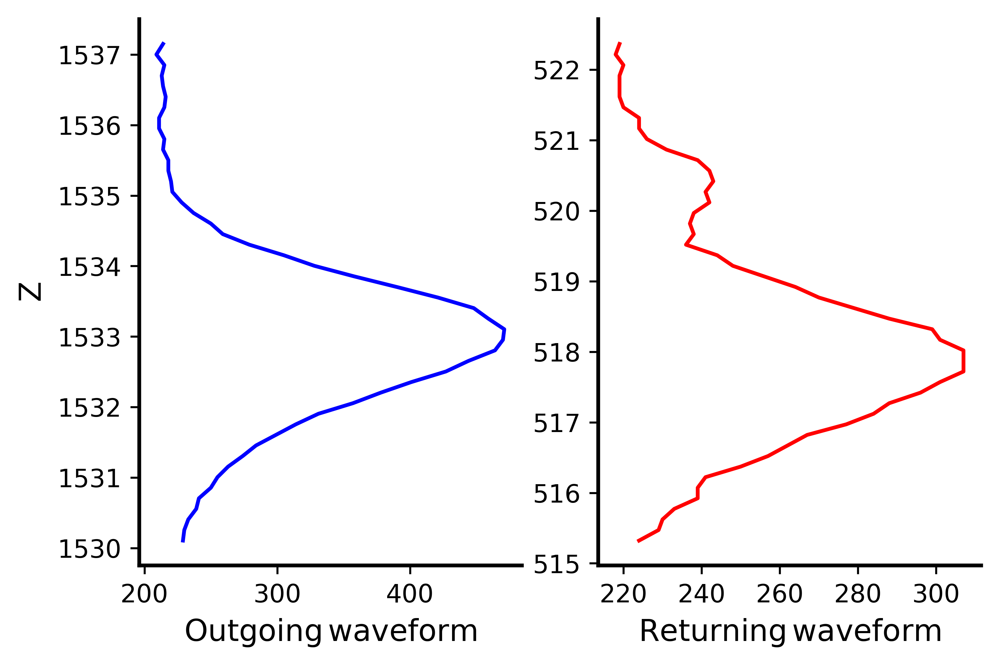
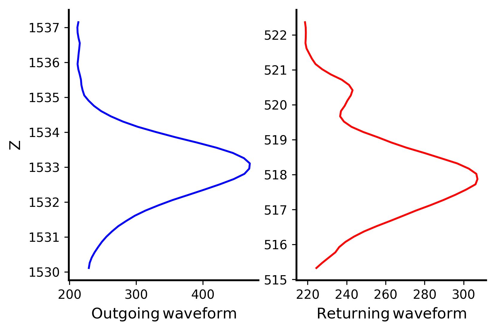
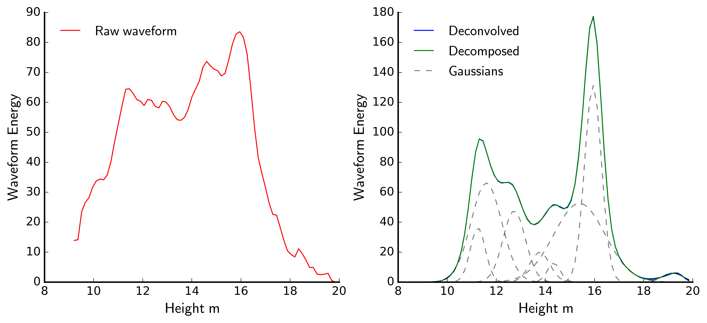

# pypwaves

pypwaves is python library for opening full waveform LiDAR data stored using the [PulseWaves
file specification](https://github.com/PulseWaves/Specification/blob/master/specification.rst)

The library is still under development but the basic function of reading pulsewave (.pls) and waveform (.wvs)
files is operational. Testing has only been done on full waveform LiDAR data collected by [NEON](http://www.neonscience.org/data/airborne-data).

## Features
* Simple plotting functions for visualizing waveforms
* Spatial indexing of waveforms using rTree for fast retrieval of waveforms
using a spatial query
* Waveform deconvolution, Gold and Richard-Lucy methods ( *Under development* )
* Gaussian decomposition ( *Under development* )
* Point cloud generation  ( *Future development* )

## Installation

pypwaves depends on the following packages:

* numpy
* matplotlib
* Rtree
* scipy

The setup script is still under development, but assuming all dependencies are installed the library can be used
by simply running the __base.py__ script.

## Use

### Reading and plotting

Read in data:

```python
import pypwaves as pw

pulsewave = pw.openPLS("path_to_pulsewaves_file.pls")
```


Retrieve waveform 0 and plot:

```python
wave = pulsewave.get_waves(0)
wave.plot()
```



Smooth the waveform in place using Savitzky-Golay filter and replot:

```python
wave.smooth(7,3)
wave.plot()
```



### Spatial indexing

Pulsewaves files are not spatially indexed, meaning that performing a spatial query can take
a very long time using a brute force method (ie. testing every waveform to see if it falls within
an area of interest). To solve this problem I have used Rtree to generate a spatial index for each 
waveform file. The resulting index file can be large (ex: 1 gb index for a 500 mb pulsewaves) however if
you have the storage space it is well worth the cost. It is especially useful for testing variable window
sizes.

The index generation process can take a bit of time as every waveform in the file must be cycled through. To reduce the
file size coordinates are only indexed in 2D space (X,Y) using 16-bit integers to store coordinates. The coordinates themselves
are the location of the last return signal from the waveform based upon the time of flight.

```python
pulsewave.create_spatial_index()
```

Given a pair of X and Y coordinates and a half-width, the IDs of the waveforms within the bounding 
box will be returned. These IDs can then be used to retrieve that actual waveforms using the '.get_waves()' method.

```python
pulses=  pulseWave.get_spatial_points(x,y,half_width)
```

### Deconvolution and Gaussian Decomposition

This section of the code is still under development but it will essentially be a python implementation of the 
Gold and Richard-Lucy deconvolution functions from the R package ['Peaks'](https://cran.r-project.org/web/packages/Peaks/Peaks.pdf).

Decomposition of the LiDAR waveform into a series of gaussian curves will be implemented using the Leven-Marquardt nonlinear least squares solver in
scipy.

Preview:



